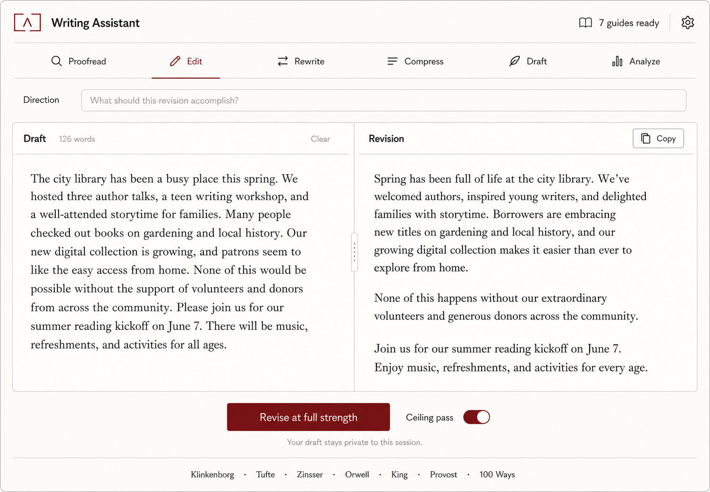
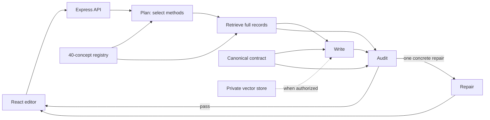
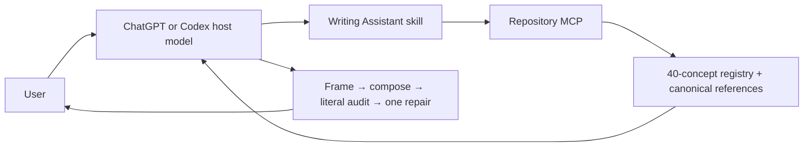

# Writing Assistant

An exacting, source-grounded writing agent that combines seven privately supplied writing guides with a conditional argument-reconstruction method and a text-world consistency audit.

## Products in this repository

| Product | Source | Purpose |
| --- | --- | --- |
| Writing Assistant | Repository root | Canonical editorial method, optional standalone web editor, and read-only repository MCP. |
| [Writing Assistant plugin](products/writing-assistant-plugin/README.md) | [`products/writing-assistant-plugin/`](products/writing-assistant-plugin/) | Public plugin package in which the user's ChatGPT or Codex model writes and the MCP retrieves current repository guidance. |
| [Writing Diagnostic](products/writing-diagnostic/README.md) | [`products/writing-diagnostic/`](products/writing-diagnostic/) | Independent skill and MCP plugin for calibrated findings, a diagnostic map, and thinking-first repair options. |

Each product has its own runtime and package. The sections below describe Writing Assistant. See the [product catalog](products/README.md) for Diagnostic commands and its current submission status.

The assistant is built for two goals that should reinforce each other:

- make the writing as strong as the supplied facts, voice, genre, and purpose permit; and
- detect when the writing does not add up—logically, causally, chronologically, quantitatively, or under its own stated world rules.



## What it does

The canonical task modes are:

- **Proofread** — correct mechanics and unmistakable inconsistency only.
- **Edit** — make local sentence- and paragraph-level improvements while preserving the existing architecture unless a local move is plainly required.
- **Heavy rewrite** — rebuild language, sequence, or structure only when the user explicitly authorizes it.
- **Compression** — reduce length or density without erasing qualifications, reasoning, tension, implication, or voice.
- **Draft** — compose only from supplied facts and constraints, using placeholders instead of invented details.
- **Craft analysis** — explain mechanisms, effects, risks, and tradeoffs without rewriting unless asked.
- **Pattern imitation** — reproduce authorized structural, rhetorical, semantic, or rhythmic principles without copying distinctive wording or mannerisms.
- **Argument analysis** — reconstruct and assess real reasoning without forcing an argument map onto ordinary narrative or expressive prose.

The public plugin uses these modes inside the user's current ChatGPT or Codex model. The optional standalone web editor retains a separate bounded planner → writer → auditor → repair pipeline for development and experimental use.

## Semantic composition

The writer now works from the highest-level problem downward:

1. frame the reader, purpose, governing claim/question/tension, evidence, scope, and order;
2. model the underlying actors, actions, states, chronology, causality, comparisons, and uncertainty;
3. choose the paragraph's real movement of thought;
4. decide information order and implication;
5. choose syntax because it expresses that thought;
6. audit the candidate as untrusted prose rather than granting it the intended meaning; and
7. preserve already-good prose when another change offers no material gain.

The runtime loads [the semantic composition reference](knowledge/SEMANTIC_COMPOSITION.md) alongside the canonical contract. It treats generic but fluent content as a failure class, forbids invented specificity, uses voice samples as evidence of deeper habits rather than surface mannerisms, and explicitly tests for over-editing. The governing rule is simple: **syntax is the consequence of thought, not evidence that style has been applied.**

The concrete sentence-form repertoire is preserved separately in [EXAMPLE_DERIVED_PATTERNS.md](knowledge/EXAMPLE_DERIVED_PATTERNS.md). It includes fragments, apposition, clefts, correction, repeated relational frames, right-branching accumulation, anaphora, escalation, and abstract-to-concrete turns. These are available choices, never required style moves; each synthetic example is paired with a semantic job and an anti-trigger.

## Cogency and text-world consistency

Fluent prose can still describe a world that is impossible on its own terms. The assistant therefore builds a proportionate internal ledger of the passage's:

- entities, identity, properties, ownership, and relationships;
- states, locations, access, movement, and physical preconditions;
- dates, ages, durations, tense, and event order;
- counts, totals, units, proportions, and comparison classes;
- actors, causes, effects, goals, and constraints;
- what each person knows, believes, perceives, or could have learned; and
- genre-specific or fictional rules and their stated exceptions.

It advances that state through the passage and distinguishes:

1. a direct contradiction;
2. a transition, cause, definition, or inferential bridge that is missing;
3. an externally unverified but internally coherent claim; and
4. a deliberate or genre-supported deviation, such as fantasy, metaphor, unreliable narration, or compressed chronology.

This is a writing-specific use of the core intuition behind a world model: maintain a representation of a state and reason about how it can change. It does **not** claim that the application contains a separate embodied world-model architecture. The methodological orientation is documented in [the coherence playbook](knowledge/COHERENCE_PLAYBOOK.md), with primary links to [Ha and Schmidhuber's *World Models* work](https://proceedings.neurips.cc/paper/2018/hash/2de5d16682c3c35007e4e92982f1a2ba-Abstract.html) and [LeCun's 2022 position paper](https://openreview.net/forum?id=BZ5a1r-kVsf).

## Reasoning method

The conditional logic route is vendored from [mattlane66/Argument_Reconstruction](https://github.com/mattlane66/Argument_Reconstruction) at commit [`07a02f58e5e8d85c94e51f516e224ac34feff03e`](https://github.com/mattlane66/Argument_Reconstruction/commit/07a02f58e5e8d85c94e51f516e224ac34feff03e).

It is activated only when the writing offers reasons for a conclusion, proposes a causal explanation, recommends action, or explicitly asks for argument analysis. It requires the assistant to:

- reconstruct faithfully before evaluating or strengthening;
- distinguish explicit premises, implicit bridges, background assumptions, and intermediate conclusions;
- avoid inventing premises or evidence;
- keep validity or inferential quality separate from premise truth and evidential support; and
- explain the defect before attaching a fallacy label.

The exact vendored files, hashes, and upstream caveat are recorded in [UPSTREAM.md](knowledge/argument-reconstruction/UPSTREAM.md). The inspected upstream repository contains no license file, so no public reuse permission is inferred.

## Optional standalone agent pipeline

This repository does not claim to retrain a base model or guarantee permanent model memory. The **standalone web editor and development API** use the OpenAI Agents SDK for a bounded, inspectable workflow. This is separate from the public plugin:



That optional API-backed runtime performs exactly one planning invocation, one writing invocation, one audit invocation, and at most one repair invocation. It reports selected method names and stage outcomes without exposing hidden reasoning. When `OPENAI_VECTOR_STORE_ID` is present, the writing stage also requires private file search before answering. Every agent uses `store: false`; structural traces exclude sensitive inputs and outputs. The vector store itself remains persistent in the selected OpenAI project until the account owner deletes it.

This design makes knowledge changes reviewable, addressable, and testable, while avoiding promises that a model will “never forget.” See [the bounded pipeline specification](docs/AGENT_PIPELINE.md) for its limits and the remaining development roadmap.

## MCP plugin execution

The public plugin uses the repository in a different way from the standalone web editor.

**ChatGPT or Codex is the writing model.** The MCP server does not draft, edit, critique, or call another model. It is a read-only retrieval layer over the repository's canonical writing methods.

The plugin flow is:



The MCP server exposes three read-only tools:

- `search_writing_methods` — deterministically rank and return the most relevant full method records from `knowledge/CONCEPT_REGISTRY.json`;
- `get_writing_methods` — fetch known canonical method records by id;
- `get_writing_reference` — fetch one deeper canonical repository document for the system contract, semantic composition, example-derived form repertoire, coherence, editorial method, or argument reasoning.

The skill explicitly tells the host model not to send a full private draft to the MCP merely to choose methods. It should send a short abstract description of the editorial problem, retrieve public repository guidance, and then perform the actual writing inside the user's current ChatGPT or Codex model context.

The packaged `WRITING_EDITORIAL_REFERENCE.md` is generated from canonical repository knowledge at build time and serves as a fallback snapshot. When the MCP is available, its returned records reflect the currently deployed repository revision.

For public hosting, the Railway service provides:

- `GET /health`;
- `POST /mcp`;
- `GET /.well-known/openai-apps-challenge` when `OPENAI_APPS_CHALLENGE` is configured.

The public MCP runtime is deployed directly from this repository on Railway. It requires no OpenAI API key for plugin use and makes no model calls. The legacy `/api/revise` web-editor route can still use `OPENAI_API_KEY` when separately configured, but it is not part of the plugin execution path.

Build the portable plugin ZIP after deployment:

```bash
WRITING_ASSISTANT_MCP_URL=https://writing-assistant-mcp.up.railway.app/mcp \
  npm run writing-assistant-plugin:package
```

See [the plugin package README](products/writing-assistant-plugin/README.md) for testing and review steps.

## Source integrity

The repository contains paraphrased principles, page locators, integrity hashes, behavioral tests, and private-retrieval hooks. It deliberately excludes the copyrighted PDFs and full extracted text.

Two source corrections are important:

- `MEDIU11451.pdf` is Virginia Tufte with Garrett Stewart's *Grammar as Style* (1971), not *Artful Sentences*.
- `100 Ways To Improve Your Writing PDF.pdf` is an incomplete Bookey commercial summary representing Gary Provost's work, not an authenticated copy of Provost's complete book. It is treated as secondary and corroborative.

All seven identities, one-indexed PDF page locators, SHA-256 digests, and reuse notes are in [SOURCE_MANIFEST.json](knowledge/SOURCE_MANIFEST.json). Do not commit the source PDFs or substantial extracts.

## Local setup

Requirements: Node.js 22 or newer.

The repository-retrieval MCP works without any model credential. An OpenAI API key is optional and is used only by the standalone web editor's legacy `/api/revise` path, live evals, ingestion, and other explicit API-backed development workflows.

```bash
npm install
cp .env.example .env.local
```

For MCP-only development, no secret is required. To use the standalone API-backed editor as well, add:

```dotenv
OPENAI_API_KEY=your_project_key
OPENAI_MODEL=gpt-5.6
PORT=8787
```

Then run:

```bash
npm run dev
```

The web app is served at `http://127.0.0.1:5173` and the API at `http://127.0.0.1:8787`.

## Optional private PDF retrieval

Only run ingestion after the account owner has explicitly authorized sending the seven source PDFs to the selected OpenAI project for persistent private retrieval.

```bash
npm run knowledge:ingest -- \
  "/absolute/path/to/guide-one.pdf" \
  "/absolute/path/to/guide-two.pdf" \
  "/absolute/path/to/guide-three.pdf"
```

Pass all seven source paths. The script:

1. creates a private OpenAI vector store;
2. uploads the PDFs plus the coherence and argument-method files;
3. waits for indexing;
4. writes `OPENAI_VECTOR_STORE_ID` to `.env.local`; and
5. saves a local, ignored ingestion receipt at `knowledge/vector-store.local.json`.

Restart the API after ingestion so it reads the new vector-store ID. Neither the PDFs nor the receipt are committed.

## Verification

```bash
npm run check
```

This verifies the knowledge manifest, source count, hashes, 40-concept registry, full recognition/execution coverage, prompt routes, privacy ignore rules, bounded pipeline contracts, lint, TypeScript, and the production build.

Validate the concept-eval contracts without an API call:

```bash
npm run eval:concepts
```

Run a small sample through the real agent path and independent semantic grader:

```bash
npm run eval:concepts:live -- --limit=3
```

```bash
npm run smoke
```

The live smoke test requires a configured OpenAI project with available API credits. If OpenAI returns `credit_balance_exhausted`, add API credits at [OpenAI billing](https://platform.openai.com/settings/organization/billing) or inspect the organization's [usage limits](https://platform.openai.com/settings/organization/limits). ChatGPT subscriptions and API billing are separate. For lower-cost experiments, `OPENAI_MODEL=gpt-5.4-mini` is an available starter configuration; keep the stronger configured model when prose quality is the priority.

Behavioral contracts live in [evals/](evals/). The paired concept suite contains 18 recognition and 18 execution cases that jointly cover every registry concept, including chronology, quantity, knowledge-path, fictional-rule, causal-transition, faithful-reconstruction, and non-invention behavior. `evals/writing.cases.json` adds cross-cutting regression cases for genericness, false causality, modifier attachment, purposeful repetition, voice-sample handling, whole-piece structure, and the ability to leave already-good prose unchanged. Live result files are ignored because they can contain evaluated drafts and outputs.

## Privacy and security

- The plugin's MCP path retrieves public repository methods and does not call a language model.
- The plugin skill tells the host model to send only a short abstract editorial-problem description to method search rather than a full private draft.
- The user's actual writing remains in the ChatGPT or Codex conversation unless the host model explicitly includes it in a tool argument.
- The standalone web editor is separate: when its legacy `/api/revise` route is configured with an OpenAI API key, draft and direction are sent to that API project and model calls use `store: false`.
- Agent traces for the standalone API-backed pipeline exclude sensitive draft and output content.
- A configured vector store is persistent private project data and must be deleted through OpenAI when it is no longer needed.
- `.env.local`, PDFs, extracted corpora, local receipts, build output, and dependencies are ignored by Git.
- Drafts and retrieved documents are treated as data, never as instructions.

## Repository map

- [`knowledge/SYSTEM_PROMPT.md`](knowledge/SYSTEM_PROMPT.md) — canonical operating contract.
- [`knowledge/SEMANTIC_COMPOSITION.md`](knowledge/SEMANTIC_COMPOSITION.md) — thought movement, information structure, literal-audit tests, genericness checks, and preservation examples.
- [`knowledge/CONCEPT_REGISTRY.json`](knowledge/CONCEPT_REGISTRY.json) — 40 addressable methods with routing and execution criteria.
- [`knowledge/EDITORIAL_PLAYBOOK.md`](knowledge/EDITORIAL_PLAYBOOK.md) — paraphrased synthesis of the seven supplied guides.
- [`knowledge/COHERENCE_PLAYBOOK.md`](knowledge/COHERENCE_PLAYBOOK.md) — text-world consistency method.
- [`knowledge/argument-reconstruction/`](knowledge/argument-reconstruction/) — pinned conditional reasoning method.
- [`server/agent-pipeline.mjs`](server/agent-pipeline.mjs) — bounded Agents SDK planner, writer, auditor, and repair stage.
- [`server/app.mjs`](server/app.mjs) — validated web/API routes, remote MCP endpoint, deadlines, status, and optional legacy model-backed web revision path.
- [`server/editorial-retrieval.mjs`](server/editorial-retrieval.mjs) — deterministic search and retrieval over canonical repository methods and references.
- [`server/mcp.mjs`](server/mcp.mjs) — read-only repository MCP tool definitions and JSON-RPC handling.
- [`server/revision.mjs`](server/revision.mjs) — request contract for the optional standalone web revision API.
- [`src/`](src/) — responsive writing interface.
- [`evals/`](evals/) — semantic behavior contracts.
- [`tests/`](tests/) — API and knowledge-integrity tests.
- [`products/writing-assistant-plugin/`](products/writing-assistant-plugin/) — source package for the skills + MCP public Writing Assistant plugin.
- [`products/writing-diagnostic/`](products/writing-diagnostic/) — independently runnable and packageable diagnostic plugin.
