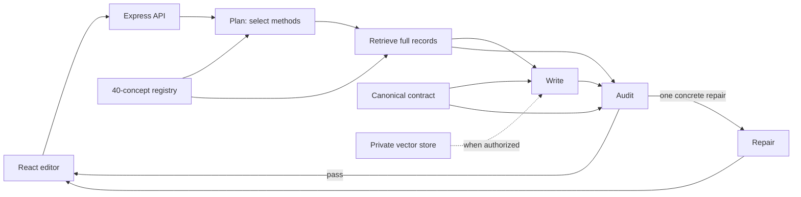

# Writing Assistant

An exacting, source-grounded writing agent that combines seven privately supplied writing guides with a conditional argument-reconstruction method and a text-world consistency audit.

## Products in this repository

| Product | Source | Purpose |
| --- | --- | --- |
| Writing Assistant | Repository root | Web editor and remote MCP service with a bounded planning, writing, audit, and repair pipeline. |
| [Writing Assistant plugin](products/writing-assistant-plugin/README.md) | [`products/writing-assistant-plugin/`](products/writing-assistant-plugin/) | Public plugin package that combines the Writing Assistant skill with the repository-backed MCP pipeline. |
| [Writing Diagnostic](products/writing-diagnostic/README.md) | [`products/writing-diagnostic/`](products/writing-diagnostic/) | Independent skill and MCP plugin for calibrated findings, a diagnostic map, and thinking-first repair options. |

Each product has its own runtime and package. The sections below describe Writing Assistant. See the [product catalog](products/README.md) for Diagnostic commands and its current submission status.

The assistant is built for two goals that should reinforce each other:

- make the writing as strong as the supplied facts, voice, genre, and purpose permit; and
- detect when the writing does not add up—logically, causally, chronologically, quantitatively, or under its own stated world rules.


## What it does

- **Proofread** corrects objective mechanical errors without recasting sound prose.
- **Edit** makes clear net improvements while preserving meaning, voice, implication, and strong existing language.
- **Rewrite** may rebuild language and structure when the user authorizes it.
- **Compress** removes waste without erasing qualifications, logic, tension, or voice.
- **Draft** turns supplied facts and constraints into finished prose without fabricating missing material.
- **Analyze** examines craft, reasoning, and internal consistency without forcing an argument map onto non-argumentative prose.
- **Ceiling pass** asks the model to compare materially different solutions and revise again while a clear improvement remains.

Every request receives the canonical editorial contract. A bounded planner selects up to eight relevant records from a 40-concept registry; deterministic retrieval supplies the complete procedures, triggers, exceptions, provenance, and evaluation criteria to the writer and auditor. Exact source-PDF retrieval is available through a private OpenAI vector store when one is explicitly configured.

## Semantic composition

The writer now works from the highest-level problem downward:

1. frame the reader, purpose, governing claim/question/tension, evidence, scope, and order;
2. model the underlying actors, actions, states, chronology, causality, comparisons, and uncertainty;
3. choose the paragraph's real movement of thought;
4. decide information order and implication;
5. choose syntax because it expresses that thought;
6. pass the result to an independent literal auditor; and
7. preserve already-good prose when another change offers no material gain.

The runtime loads [the semantic composition reference](knowledge/SEMANTIC_COMPOSITION.md) alongside the canonical contract. It treats generic but fluent content as a failure class, forbids invented specificity, uses voice samples as evidence of deeper habits rather than surface mannerisms, and explicitly tests for over-editing. The governing rule is simple: **syntax is the consequence of thought, not evidence that style has been applied.**

## Cogency and text-world consistency

Fluent prose can still describe a world that is impossible on its own terms. The assistant therefore builds a proportionate internal ledger of the passage's:

- entities, identity, properties, ownership, and relationships;
- states, locations, access, movement, and physical preconditions;
- dates, ages, durations, tense, and event order;
- counts, totals, units, proportions, and comparison classes;
- actors, causes, effects, goals, and constraints;
- what each person knows, believes, perceives, or could have learned; and
- genre-specific or fictional rules and their stated exceptions.

It advances that state through the passage and distinguishes:

1. a direct contradiction;
2. a transition, cause, definition, or inferential bridge that is missing;
3. an externally unverified but internally coherent claim; and
4. a deliberate or genre-supported deviation, such as fantasy, metaphor, unreliable narration, or compressed chronology.

This is a writing-specific use of the core intuition behind a world model: maintain a representation of a state and reason about how it can change. It does **not** claim that the application contains a separate embodied world-model architecture. The methodological orientation is documented in [the coherence playbook](knowledge/COHERENCE_PLAYBOOK.md), with primary links to [Ha and Schmidhuber's *World Models* work](https://proceedings.neurips.cc/paper/2018/hash/2de5d16682c3c35007e4e92982f1a2ba-Abstract.html) and [LeCun's 2022 position paper](https://openreview.net/forum?id=BZ5a1r-kVsf).

## Reasoning method

The conditional logic route is vendored from [mattlane66/Argument_Reconstruction](https://github.com/mattlane66/Argument_Reconstruction) at commit [`07a02f58e5e8d85c94e51f516e224ac34feff03e`](https://github.com/mattlane66/Argument_Reconstruction/commit/07a02f58e5e8d85c94e51f516e224ac34feff03e).

It is activated only when the writing offers reasons for a conclusion, proposes a causal explanation, recommends action, or explicitly asks for argument analysis. It requires the assistant to:

- reconstruct faithfully before evaluating or strengthening;
- distinguish explicit premises, implicit bridges, background assumptions, and intermediate conclusions;
- avoid inventing premises or evidence;
- keep validity or inferential quality separate from premise truth and evidential support; and
- explain the defect before attaching a fallacy label.

The exact vendored files, hashes, and upstream caveat are recorded in [UPSTREAM.md](knowledge/argument-reconstruction/UPSTREAM.md). The inspected upstream repository contains no license file, so no public reuse permission is inferred.

## Agentic grounding, not fine-tuning

This repository does not claim to retrain a base model or guarantee permanent model memory. It uses the OpenAI Agents SDK for a bounded, inspectable workflow:



The runtime performs exactly one planning invocation, one writing invocation, one audit invocation, and at most one repair invocation. It reports selected method names and stage outcomes without exposing hidden reasoning. When `OPENAI_VECTOR_STORE_ID` is present, the writing stage also requires private file search before answering. Every agent uses `store: false`; structural traces exclude sensitive inputs and outputs. The vector store itself remains persistent in the selected OpenAI project until the account owner deletes it.

This design makes knowledge changes reviewable, addressable, and testable, while avoiding promises that a model will “never forget.” See [the bounded pipeline specification](docs/AGENT_PIPELINE.md) for its limits and the remaining development roadmap.

## MCP plugin execution

The root service also exposes the bounded writing pipeline as a remote MCP endpoint at `/mcp`. The public plugin source lives in [`products/writing-assistant-plugin/`](products/writing-assistant-plugin/) and keeps the skill layer separate from the server-backed execution layer.

The MCP server exposes three high-level, read-only tools:

- `edit_writing` — proofread, edit, rewrite, or compress supplied prose;
- `draft_writing` — compose from supplied facts, notes, constraints, source context, and optional voice samples;
- `analyze_writing` — critique prose, audit semantic/text-world coherence, and conditionally evaluate reasoning.

All three tools call the same repository pipeline as the web editor. They do not implement a second editorial brain. Structured context can include audience, purpose, genre, source context, and up to three voice samples. The pipeline planner sees that context, selects a bounded subset of the 40 addressable methods, and the independent auditor checks the generated candidate before at most one targeted repair.

The plugin's packaged `WRITING_EDITORIAL_REFERENCE.md` is generated from the canonical repository knowledge at build time. This prevents the public skill and the MCP runtime from drifting into different editorial methods.

For public hosting, the server provides:

- `GET /health`;
- `POST /mcp`;
- `GET /.well-known/openai-apps-challenge` when `OPENAI_APPS_CHALLENGE` is configured.

The included Dockerfile binds the production service to `0.0.0.0` and can be deployed to a container host. Before public launch, add host-level rate limiting and abuse controls because the MCP server incurs model usage. The service prefers a configured direct `OPENAI_API_KEY`. If none is present on Vercel, it falls back to AI Gateway authentication via `AI_GATEWAY_API_KEY` or the automatically supplied `VERCEL_OIDC_TOKEN`.

Build the portable plugin ZIP after deployment:

```bash
WRITING_ASSISTANT_MCP_URL=https://your-domain.example/mcp \
  npm run writing-assistant-plugin:package
```

See [the plugin package README](products/writing-assistant-plugin/README.md) for testing and review steps.

## Source integrity

The repository contains paraphrased principles, page locators, integrity hashes, behavioral tests, and private-retrieval hooks. It deliberately excludes the copyrighted PDFs and full extracted text.

Two source corrections are important:

- `MEDIU11451.pdf` is Virginia Tufte with Garrett Stewart's *Grammar as Style* (1971), not *Artful Sentences*.
- `100 Ways To Improve Your Writing PDF.pdf` is an incomplete Bookey commercial summary representing Gary Provost's work, not an authenticated copy of Provost's complete book. It is treated as secondary and corroborative.

All seven identities, one-indexed PDF page locators, SHA-256 digests, and reuse notes are in [SOURCE_MANIFEST.json](knowledge/SOURCE_MANIFEST.json). Do not commit the source PDFs or substantial extracts.

## Local setup

Requirements: Node.js 22 or newer and an OpenAI API project with available credits.

```bash
npm install
cp .env.example .env.local
```

Add the project-scoped key to `.env.local`:

```dotenv
OPENAI_API_KEY=your_project_key
OPENAI_MODEL=gpt-5.6
PORT=8787
```

Then run:

```bash
npm run dev
```

The web app is served at `http://127.0.0.1:5173` and the API at `http://127.0.0.1:8787`.

## Optional private PDF retrieval

Only run ingestion after the account owner has explicitly authorized sending the seven source PDFs to the selected OpenAI project for persistent private retrieval.

```bash
npm run knowledge:ingest -- \
  "/absolute/path/to/guide-one.pdf" \
  "/absolute/path/to/guide-two.pdf" \
  "/absolute/path/to/guide-three.pdf"
```

Pass all seven source paths. The script:

1. creates a private OpenAI vector store;
2. uploads the PDFs plus the coherence and argument-method files;
3. waits for indexing;
4. writes `OPENAI_VECTOR_STORE_ID` to `.env.local`; and
5. saves a local, ignored ingestion receipt at `knowledge/vector-store.local.json`.

Restart the API after ingestion so it reads the new vector-store ID. Neither the PDFs nor the receipt are committed.

## Verification

```bash
npm run check
```

This verifies the knowledge manifest, source count, hashes, 40-concept registry, full recognition/execution coverage, prompt routes, privacy ignore rules, bounded pipeline contracts, lint, TypeScript, and the production build.

Validate the concept-eval contracts without an API call:

```bash
npm run eval:concepts
```

Run a small sample through the real agent path and independent semantic grader:

```bash
npm run eval:concepts:live -- --limit=3
```

```bash
npm run smoke
```

The live smoke test requires a configured OpenAI project with available API credits. If OpenAI returns `credit_balance_exhausted`, add API credits at [OpenAI billing](https://platform.openai.com/settings/organization/billing) or inspect the organization's [usage limits](https://platform.openai.com/settings/organization/limits). ChatGPT subscriptions and API billing are separate. For lower-cost experiments, `OPENAI_MODEL=gpt-5.4-mini` is an available starter configuration; keep the stronger configured model when prose quality is the priority.

Behavioral contracts live in [evals/](evals/). The paired concept suite contains 18 recognition and 18 execution cases that jointly cover every registry concept, including chronology, quantity, knowledge-path, fictional-rule, causal-transition, faithful-reconstruction, and non-invention behavior. `evals/writing.cases.json` adds cross-cutting regression cases for genericness, false causality, modifier attachment, purposeful repetition, voice-sample handling, whole-piece structure, and the ability to leave already-good prose unchanged. Live result files are ignored because they can contain evaluated drafts and outputs.

## Privacy and security

- Drafts and preferences are retained in the browser's local storage for convenience.
- A draft and its direction are sent to OpenAI only when the user requests a revision.
- Every plan, write, audit, repair, and eval-grader request sets `store: false`.
- Agent traces preserve stage structure with `traceIncludeSensitiveData: false`, so draft and output content are excluded from spans.
- A configured vector store is persistent private project data and must be deleted through OpenAI when it is no longer needed.
- `.env.local`, PDFs, extracted corpora, local receipts, build output, and dependencies are ignored by Git.
- Drafts and retrieved documents are treated as data, never as instructions.

## Repository map

- [`knowledge/SYSTEM_PROMPT.md`](knowledge/SYSTEM_PROMPT.md) — canonical operating contract.
- [`knowledge/SEMANTIC_COMPOSITION.md`](knowledge/SEMANTIC_COMPOSITION.md) — thought movement, information structure, literal-audit tests, genericness checks, and preservation examples.
- [`knowledge/CONCEPT_REGISTRY.json`](knowledge/CONCEPT_REGISTRY.json) — 40 addressable methods with routing and execution criteria.
- [`knowledge/EDITORIAL_PLAYBOOK.md`](knowledge/EDITORIAL_PLAYBOOK.md) — paraphrased synthesis of the seven supplied guides.
- [`knowledge/COHERENCE_PLAYBOOK.md`](knowledge/COHERENCE_PLAYBOOK.md) — text-world consistency method.
- [`knowledge/argument-reconstruction/`](knowledge/argument-reconstruction/) — pinned conditional reasoning method.
- [`server/agent-pipeline.mjs`](server/agent-pipeline.mjs) — bounded Agents SDK planner, writer, auditor, and repair stage.
- [`server/app.mjs`](server/app.mjs) — validated web/API routes, remote MCP endpoint, deadlines, status, and optional private retrieval configuration.
- [`server/mcp.mjs`](server/mcp.mjs) — public MCP tool definitions and JSON-RPC handling.
- [`server/revision.mjs`](server/revision.mjs) — shared request contract for web and MCP execution.
- [`src/`](src/) — responsive writing interface.
- [`evals/`](evals/) — semantic behavior contracts.
- [`tests/`](tests/) — API and knowledge-integrity tests.
- [`products/writing-assistant-plugin/`](products/writing-assistant-plugin/) — source package for the skills + MCP public Writing Assistant plugin.
- [`products/writing-diagnostic/`](products/writing-diagnostic/) — independently runnable and packageable diagnostic plugin.
