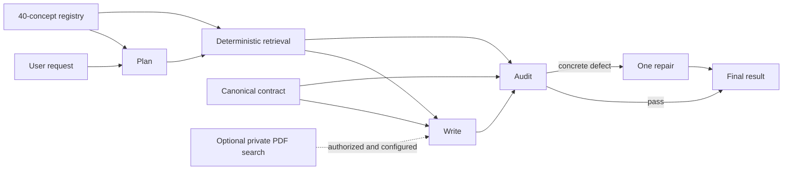

# Bounded writing-agent pipeline

## What the “brain” means here

The application does not fine-tune a base model or give it permanent memory of the books. It turns the supplied material into an inspectable procedural system:

1. a canonical operating contract that always applies;
2. a versioned registry of addressable writing and reasoning methods;
3. a planner that recognizes which methods fit the request;
4. deterministic retrieval of the complete selected method records;
5. a writer that applies those records;
6. an auditor that checks the result against their execution criteria; and
7. no more than one targeted repair.

This is more controlled than attaching undifferentiated files to a chat, but it is not a promise of perfect recall or judgment.

## Runtime sequence



The model gets one planning invocation, one writing invocation, one audit invocation, and at most one repair invocation. Local registry retrieval is deterministic and does not consume a model turn. A request has a two-minute server deadline. The planner may select no more than eight unique concepts.

## Addressable knowledge

`knowledge/CONCEPT_REGISTRY.json` contains 40 stable concept IDs across six categories:

| Category | Concepts |
| --- | ---: |
| Editorial contract | 5 |
| Craft | 8 |
| Syntax | 7 |
| Source discipline | 5 |
| Text-world coherence | 6 |
| Argument reasoning | 9 |

Each record contains a description, procedure, triggers, anti-triggers, exceptions, provenance locators, and separate recognition and execution criteria. The registry represents all seven supplied references, the coherence method, and the pinned Argument Reconstruction method. It preserves the Bookey and *Grammar as Style* identity caveats instead of treating every file as equally authoritative.

## Inspection and privacy

The API returns the selected concept names, stage completion states, and whether the audit passed or invoked repair. It does not return planner rationale, audit deliberation, or chain-of-thought.

Every agent sets `store: false`. Agents SDK traces remain structurally useful, but `traceIncludeSensitiveData: false` prevents draft, candidate, tool input, and model output content from being attached to trace spans. A private vector store is used only when explicitly configured; `grounded` is true only when file search actually returns results.

## Evaluation contract

The deterministic eval contract contains 18 recognition cases and 18 paired execution cases, jointly covering all 40 concepts. Recognition grades required and forbidden routing. Execution uses concept-specific pass conditions and failure signals. The optional live harness runs each pair through the real pipeline and uses a separate structured-output grader.

```bash
npm run eval:concepts
npm run eval:concepts:live -- --limit=3
```

Live results are local and ignored because they may contain drafts and outputs.

## What still improves the “brain”

The core procedural brain is present. The next work should improve evidence of reliability and adaptation, in this order:

1. **Live baseline and calibration.** Run the paired suite against a funded API project, inspect false selections and failed applications, then revise prompts, concepts, or rubrics. Until this happens, the architecture is verified but prose quality is not empirically calibrated across the full matrix.
2. **Coverage expansion.** Add an atomic coverage map from every material guide section to one or more concept IDs, and add new concepts only where a distinct decision procedure is missing. This tests the phrase “all the materials” instead of relying on impressionistic completeness.
3. **Feedback and regression loop.** Let users accept, reject, or partially edit a result; save that choice only with consent; turn recurring failures into anonymized eval cases. This is how the assistant improves systematically without pretending each conversation retrains the model.
4. **Explicit preference memory.** Store user-approved voice, audience, genre, taboo, and house-style preferences separately from source knowledge, with view/edit/delete controls. Never infer durable preferences from one draft.
5. **Long-document state.** Add hierarchical document planning, section summaries, entity/timeline ledgers, and cross-section audits so the same methods remain reliable beyond a single request window.
6. **Authorized primary retrieval.** If the owner explicitly permits persistent upload, ingest the seven PDFs into the selected private project with file metadata and page-aware retrieval. This improves exact source checking; it does not replace the concept registry.
7. **Adversarial and domain evals.** Expand tests for prompt injection inside drafts, ambiguous genre conventions, quantitative traps, hidden timeline conflicts, mixed arguments, and high-stakes factual prose.
8. **Operational controls.** Measure latency, token cost, concept-selection frequency, repair rate, and per-concept pass rate without logging sensitive prose. Add model fallback only if it preserves structured outputs and stage bounds.

Fine-tuning should come later, if at all. It becomes useful only after enough consented, high-quality before/after examples and stable graders exist. It cannot replace retrieval, explicit routing, source integrity, or evaluations.
