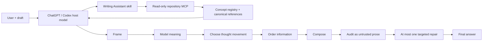

# Writing Assistant execution architecture

## Two execution paths

Writing Assistant now has two distinct execution paths. They share the same canonical editorial knowledge but serve different products.

### Public ChatGPT / Codex plugin

The public plugin uses the user's current ChatGPT or Codex model as the writer and reasoner.

The remote MCP is **read-only repository retrieval**. It does not call a language model, draft prose, edit prose, or run a second hidden agent pipeline.

The plugin flow is:

The MCP exposes three tools:

- `search_writing_methods` — deterministically rank and return full canonical method records from `knowledge/CONCEPT_REGISTRY.json`;
- `get_writing_methods` — fetch known method records by stable id;
- `get_writing_reference` — fetch deeper canonical references such as the system contract, semantic composition, example-derived repertoire, coherence method, editorial playbook, and argument method.

The skill instructs the host model to send an abstract editorial-problem description to method search rather than the user's full private draft when that is sufficient for routing.

The audit and repair stages are **logical passes by the same host model**. They are not separate model invocations.

### Standalone web editor / development API

The repository also retains the earlier bounded Agents SDK pipeline for the optional standalone web editor and development evaluation work.

That legacy API-backed path is:

1. canonical operating contract;
2. planner;
3. deterministic concept retrieval;
4. writer model call;
5. auditor model call;
6. at most one repair model call.

It lives behind `/api/revise`, requires a configured `OPENAI_API_KEY`, and is **not part of the public plugin execution path**.

This separation lets the repository keep the stronger multi-invocation experimental harness without making public plugin users consume the developer's API account.

## Canonical knowledge

The shared method is defined by:

- `knowledge/SYSTEM_PROMPT.md` — complete task, mode, source, fidelity, coherence, and argument contract;
- `knowledge/SEMANTIC_COMPOSITION.md` — purpose → semantic relations → thought movement → information structure → syntax → literal audit → preservation;
- `knowledge/EXAMPLE_DERIVED_PATTERNS.md` — concrete syntactic and compositional repertoire abstracted from close reading, with synthetic examples and anti-triggers;
- `knowledge/EDITORIAL_PLAYBOOK.md` — broader craft, genre, voice, reader-state, and source-grounded editorial guidance;
- `knowledge/COHERENCE_PLAYBOOK.md` — compact text-world state and consistency checks;
- `knowledge/argument-reconstruction/` — faithful argument reconstruction and evaluation;
- `knowledge/CONCEPT_REGISTRY.json` — 40 addressable methods used for deterministic retrieval.

The example-derived repertoire is deliberately not another style checklist. Its forms are available choices whose use must be justified by semantic or informational work.

## Evaluation

Three test layers protect the method:

1. `evals/concept-recognition.cases.json` — concept selection;
2. `evals/concept-execution.cases.json` — concept-specific behavior;
3. `evals/writing.cases.json` and `evals/example-derived-patterns.cases.json` — cross-cutting writing behavior and concrete sentence-form regressions.

The example-derived regression file covers every stable pattern in `knowledge/EXAMPLE_DERIVED_PATTERNS.md` so the concrete repertoire cannot silently disappear while the abstract principles remain.

## Privacy

For the public plugin:

- the user's writing remains in the ChatGPT or Codex conversation by default;
- the MCP receives only the tool arguments the host model chooses to send;
- the skill directs the host model to use short abstract task descriptions for method search;
- the MCP makes no language-model calls and requires no OpenAI API key.

For the optional API-backed web editor:

- model requests use `store: false`;
- traces exclude sensitive draft and output content;
- a private vector store is used only when explicitly configured.

## What to improve next

The main remaining work is empirical rather than architectural:

1. compare baseline host-model outputs with Writing Assistant outputs across the regression suites;
2. add new cases whenever a recurring failure is found;
3. expand long-document state and cross-section consistency tests;
4. keep the example-derived repertoire descriptive rather than prescriptive;
5. update canonical knowledge first, then let both the MCP and packaged fallback inherit it.
